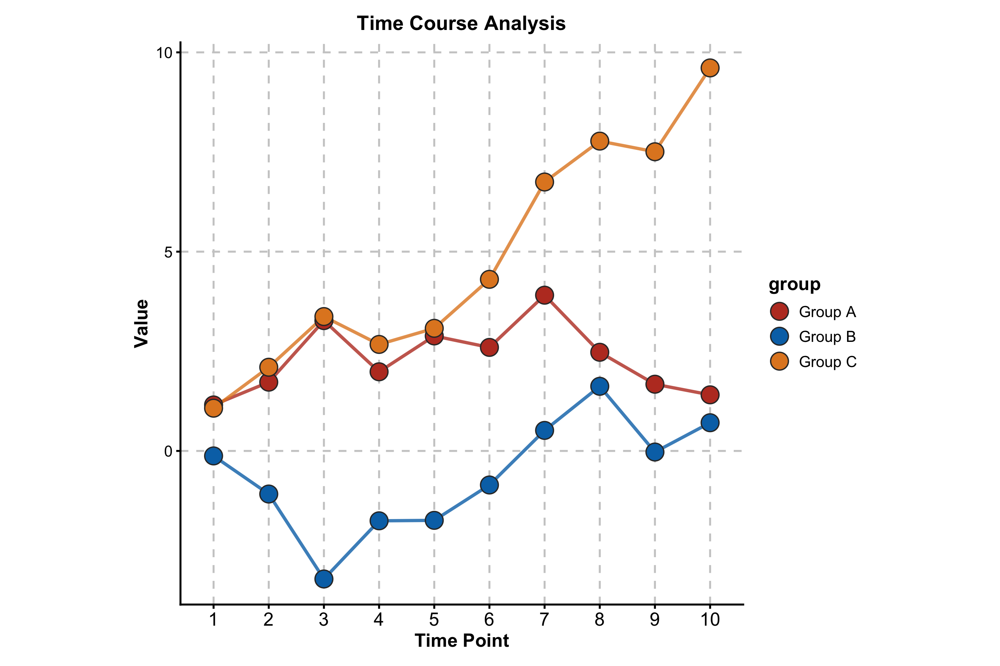
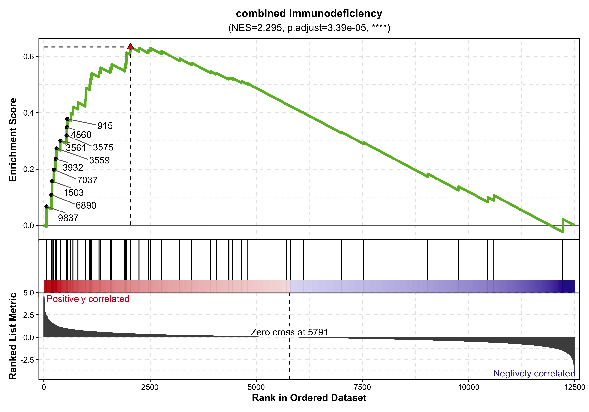
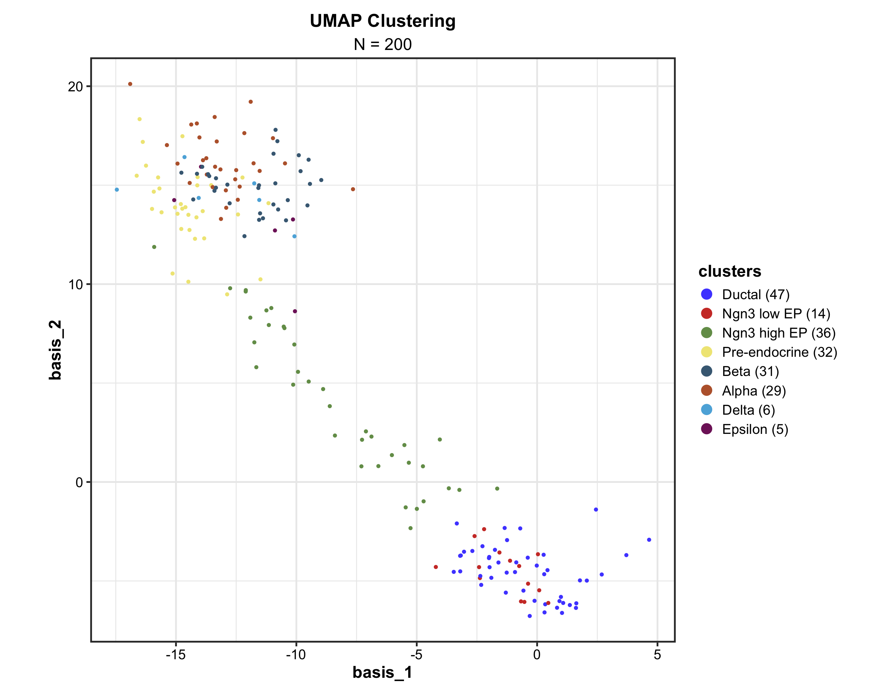
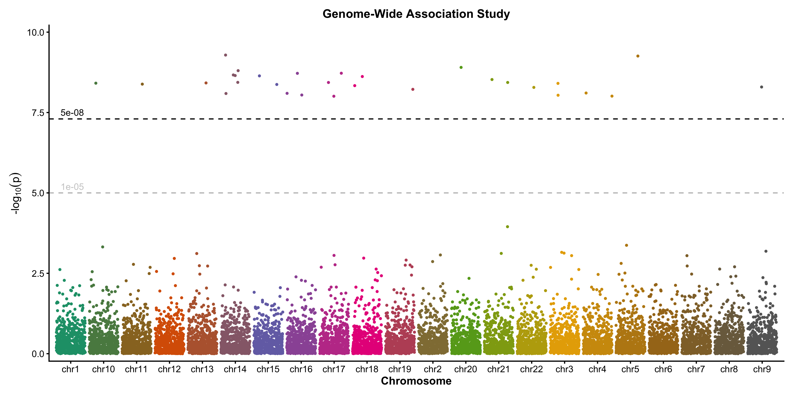
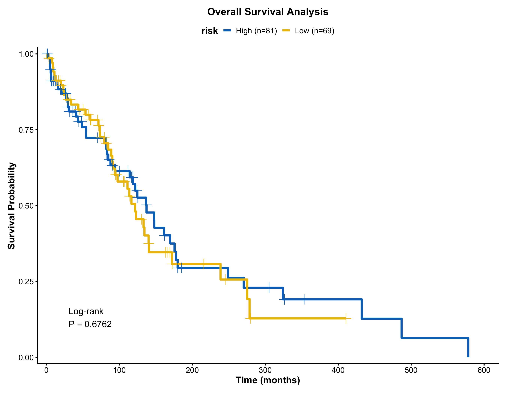
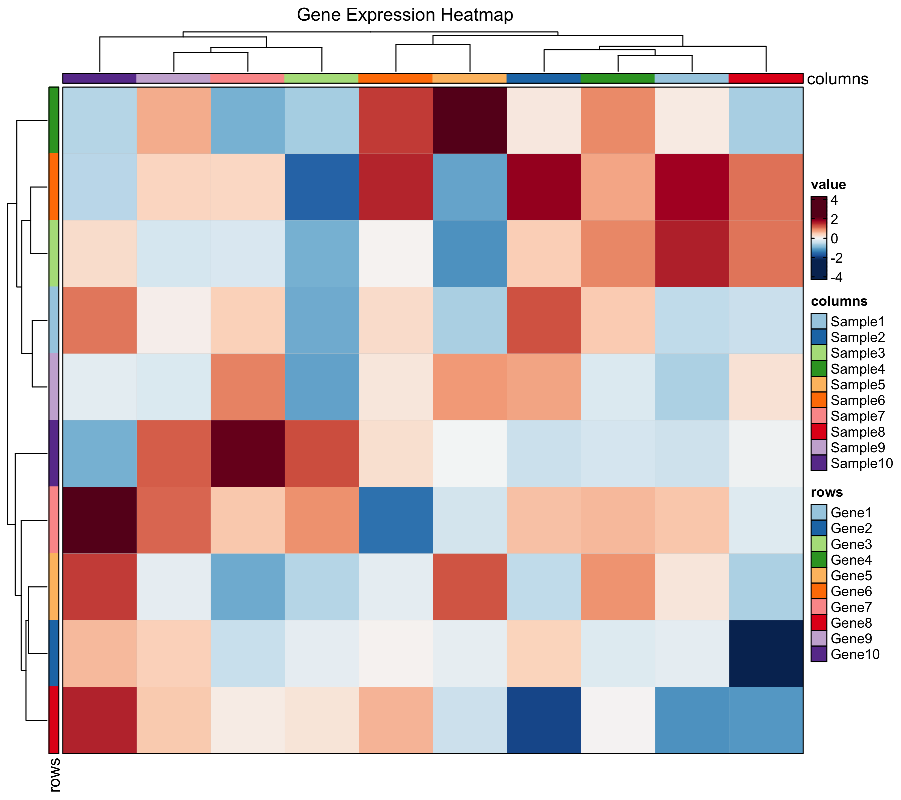

<!-- README.md is generated from README.Rmd. Please edit that file -->

# ggforge 

[](https://lifecycle.r-lib.org/articles/stages.html#experimental)
[](https://www.gnu.org/licenses/gpl-3.0)

## Comprehensive Visualization Toolkit for Biomedical Research

ggforge is a comprehensive and elegant visualization framework designed
for biomedical and bioinformatics research. Built on ggplot2 with a
modern modular architecture, it provides 40+ plotting functions covering
statistical graphics, enrichment analysis, single-cell transcriptomics,
spatial analysis, survival analysis, and genomics visualization.

------------------------------------------------------------------------

## Documentation

### Online Resources

**Complete documentation and interactive tutorials are available at:**

### **<https://zaoqu-liu.github.io/ggforge>**

- **Getting Started Tutorial**: [Introduction to
  ggforge](https://zaoqu-liu.github.io/ggforge/articles/introduction.html)
- **Function Reference**: [Complete API
  Documentation](https://zaoqu-liu.github.io/ggforge/reference/)
- **GitHub Repository**: <https://github.com/Zaoqu-Liu/ggforge>

------------------------------------------------------------------------

## Installation

``` r
# Install from GitHub
if (!require("devtools")) install.packages("devtools")
devtools::install_github("Zaoqu-Liu/ggforge")
```

## Quick Start

``` r
library(ggforge)
library(ggplot2)
library(dplyr)
set.seed(8525)
```

------------------------------------------------------------------------

## Examples

### Basic Statistical Plots

**Box Plots**

``` r
data <- data.frame(
  group = rep(c("Control", "Treatment A", "Treatment B"), each = 50),
  value = c(rnorm(50, 10, 2), rnorm(50, 12, 2.5), rnorm(50, 15, 2))
)

BoxPlot(
  data = data,
  x = "group",
  y = "value",
  palette = "lancet",
  add_point = TRUE,
  point_alpha = 0.3,
  xlab = "Treatment Group",
  ylab = "Expression Level",
  title = "Gene Expression Across Treatment Groups"
)
```


**Violin Plots**

``` r
ViolinPlot(
  data = data,
  x = "group",
  y = "value",
  palette = "npg",
  add_box = TRUE,
  add_point = TRUE,
  point_size = 0.8,
  point_alpha = 0.4,
  title = "Distribution of Gene Expression"
)
```


**Scatter Plots**

``` r
n <- 200
scatter_data <- data.frame(
  gene_A = rnorm(n, 100, 20),
  gene_B = rnorm(n, 100, 20),
  cell_type = sample(c("T cell", "B cell", "Monocyte"), n, replace = TRUE)
)
scatter_data$gene_B <- scatter_data$gene_B + 0.7 * scatter_data$gene_A + rnorm(n, 0, 10)

ScatterPlot(
  data = scatter_data,
  x = "gene_A",
  y = "gene_B",
  group_by = "cell_type",
  palette = "jco",
  add_smooth = TRUE,
  add_stat = TRUE,
  xlab = "Gene A Expression",
  ylab = "Gene B Expression",
  title = "Gene Expression Correlation"
)
```


**Density Plots**

``` r
DensityPlot(
  data = data,
  x = "value",
  group_by = "group",
  palette = "npg",
  add_rug = TRUE,
  xlab = "Expression Value",
  title = "Distribution of Gene Expression"
)
```


**Bar Plots**

``` r
BarPlot(
  data = data,
  x = "group",
  y = "value",
  palette = "Set2",
  add_errorbar = TRUE,
  errorbar_type = "se",
  title = "Mean Values with Standard Error",
  xlab = "Treatment Group",
  ylab = "Mean Expression"
)
```


**Line Plots**

``` r
time_data <- data.frame(
  time = rep(1:10, 3),
  value = c(
    cumsum(rnorm(10, 0.5, 1)),
    cumsum(rnorm(10, 0.3, 1)),
    cumsum(rnorm(10, 0.7, 1))
  ),
  group = rep(c("Group A", "Group B", "Group C"), each = 10)
)

LinePlot(
  data = time_data,
  x = "time",
  y = "value",
  group_by = "group",
  palette = "nejm",
  add_point = TRUE,
  add_smooth = TRUE,
  title = "Time Course Analysis",
  xlab = "Time Point",
  ylab = "Value"
)
```



------------------------------------------------------------------------

### Enrichment Analysis

**Enrichment Network**

``` r
data("enrich_multidb_example")

EnrichNetwork(
  data = enrich_multidb_example,
  top_term = 20,
  layout = "fr",
  palette = "Set3",
  title = "Enrichment Network Analysis"
)
```


**Enrichment Map**

``` r
data("enrich_example")

EnrichMap(
  data = enrich_example,
  top_term = 25,
  layout = "fr",
  palette = "Spectral",
  title = "GO Enrichment Map"
)
```


------------------------------------------------------------------------

### GSEA Visualization

**GSEA Summary Plot**

``` r
data("gsea_example")

GSEASummaryPlot(
  data = gsea_example,
  top_term = 20,
  palette = "RdBu",
  title = "GSEA Analysis Summary"
)
```


**GSEA Enrichment Plot**

``` r
GSEAPlot(
  data = gsea_example,
  gs = gsea_example$ID[1],
  title = gsea_example$Description[1]
)
```



------------------------------------------------------------------------

### Single-Cell Analysis

**Dimensionality Reduction**

``` r
data("dim_example")

DimPlot(
  data = dim_example,
  x = "basis_1",
  y = "basis_2",
  group_by = "clusters",
  palette = "igv",
  point_size = 1.2,
  add_label = TRUE,
  label_insitu = TRUE,
  title = "UMAP Clustering"
)
```



**Feature Expression**

``` r
dim_example$feature <- rnorm(nrow(dim_example))

FeatureDimPlot(
  data = dim_example,
  x = "basis_1",
  y = "basis_2",
  feature = "feature",
  palette = "viridis",
  point_size = 1.5,
  title = "Gene Expression on UMAP"
)
```


**RNA Velocity**

``` r
embedding <- as.matrix(dim_example[, c("basis_1", "basis_2")])
v_embedding <- as.matrix(dim_example[, c("stochasticbasis_1", "stochasticbasis_2")])

VelocityPlot(
  embedding = embedding,
  v_embedding = v_embedding,
  plot_type = "grid",
  title = "RNA Velocity Analysis"
)
```


------------------------------------------------------------------------

### Genomics Visualization

**Volcano Plot**

``` r
deg_data <- data.frame(
  gene = paste0("Gene", 1:500),
  log2FC = rnorm(500, 0, 1.5),
  pvalue = runif(500, 0, 0.1)
)
deg_data$padj <- p.adjust(deg_data$pvalue, method = "BH")

sig_up <- sample(1:500, 25)
sig_down <- sample(1:500, 25)
deg_data$log2FC[sig_up] <- abs(rnorm(25, 2, 0.5))
deg_data$log2FC[sig_down] <- -abs(rnorm(25, 2, 0.5))
deg_data$padj[c(sig_up, sig_down)] <- runif(50, 0, 0.01)

VolcanoPlot(
  data = deg_data,
  x = "log2FC",
  y = "padj",
  label_by = "gene",
  x_cutoff = 1,
  y_cutoff = 0.05,
  nlabel = 10,
  title = "Differential Expression Analysis",
  xlab = "log2 Fold Change",
  ylab = "-log10(Adjusted P-value)"
)
```


**Manhattan Plot**

``` r
gwas_data <- data.frame(
  chr = rep(paste0("chr", 1:22), each = 500),
  pos = rep(1:500, 22) * 1e5,
  pvalue = runif(11000, 0, 1)
)
gwas_data$pvalue[sample(1:11000, 30)] <- runif(30, 0, 1e-8)

ManhattanPlot(
  data = gwas_data,
  chr_by = "chr",
  pos_by = "pos",
  pval_by = "pvalue",
  threshold = 5e-8,
  title = "Genome-Wide Association Study"
)
```



------------------------------------------------------------------------

### Survival Analysis

**Kaplan-Meier Curve**

``` r
surv_data <- data.frame(
  time = rexp(150, 0.01),
  status = sample(0:1, 150, replace = TRUE, prob = c(0.4, 0.6)),
  risk = sample(c("Low", "High"), 150, replace = TRUE)
)

KMPlot(
  data = surv_data,
  time = "time",
  status = "status",
  group_by = "risk",
  palette = "jco",
  add_risktable = TRUE,
  add_conf_int = TRUE,
  add_pval = TRUE,
  title = "Overall Survival Analysis",
  xlab = "Time (months)",
  ylab = "Survival Probability"
)
```



------------------------------------------------------------------------

### Network Visualization

**Heatmap**

``` r
set.seed(123)
mat <- matrix(rnorm(100), 10, 10)
rownames(mat) <- paste0("Gene", 1:10)
colnames(mat) <- paste0("Sample", 1:10)

Heatmap(
  data = mat,
  palette = "RdBu",
  title = "Gene Expression Heatmap"
)
```



**Chord Diagram**

``` r
chord_data <- data.frame(
  from = c("CD4 T", "CD8 T", "B cell", "NK", "Monocyte"),
  to = c("Fibroblast", "Endothelial", "Fibroblast", "Tumor", "Tumor"),
  value = c(15, 20, 10, 25, 18)
)

ChordPlot(
  data = chord_data,
  from = "from",
  to = "to",
  y = "value",
  palette = "Set3",
  title = "Cell-Cell Interaction Network"
)
```


**Venn Diagram**

``` r
venn_data <- list(
  SetA = paste0("Gene", 1:100),
  SetB = paste0("Gene", 50:150),
  SetC = paste0("Gene", 80:180)
)

VennDiagram(
  data = venn_data,
  palette = "Set2",
  title = "Gene Set Overlap"
)
```


------------------------------------------------------------------------

### Color Palettes

``` r
show_palettes(head(names(palette_list), 20))
#>  [1] "1"  "2"  "3"  "4"  "5"  "6"  "7"  "8"  "9"  "10" "11" "12" "13" "14" "15"
#> [16] "16" "17" "18" "19" "20"
```

------------------------------------------------------------------------

### Advanced Features

**Multi-Panel Layouts**

``` r
multi_data <- data.frame(
  x = rep(1:10, 9),
  y = rnorm(90, rep(1:3, each = 30), 0.5),
  group = rep(c("A", "B", "C"), each = 30),
  condition = rep(rep(c("Ctrl", "Treat1", "Treat2"), each = 10), 3)
)

LinePlot(
  data = multi_data,
  x = "x",
  y = "y",
  group_by = "condition",
  split_by = "group",
  palette = "nejm",
  add_point = TRUE,
  combine = TRUE,
  nrow = 1
)
```


------------------------------------------------------------------------

## Key Features

- **40+ plotting functions** covering comprehensive biomedical
  visualization needs
- **Unified API design** with consistent interface across all functions
- **Intelligent type detection** for automatic variable styling
- **Extensive color palettes** from RColorBrewer, ggsci, viridis, and
  custom collections
- **Multi-panel layouts** with automatic data splitting and combination
- **Professional themes** optimized for scientific publications

## Function Categories

### Statistical Plots

`ScatterPlot()`, `LinePlot()`, `BarPlot()`, `BoxPlot()`, `ViolinPlot()`,
`DensityPlot()`, `JitterPlot()`, `AreaPlot()`, `Histogram()`,
`QQPlot()`, `TrendPlot()`, `RidgePlot()`, `DotPlot()`, `LollipopPlot()`,
`WaterfallPlot()`

### Enrichment & Pathway Analysis

`EnrichMap()`, `EnrichNetwork()`, `GSEASummaryPlot()`, `GSEAPlot()`

### Single-Cell & Spatial Analysis

`DimPlot()`, `FeatureDimPlot()`, `VelocityPlot()`, `SpatImagePlot()`,
`SpatPointsPlot()`, `SpatShapesPlot()`, `SpatMasksPlot()`

### Genomics

`VolcanoPlot()`, `ManhattanPlot()`, `VennDiagram()`, `UpsetPlot()`

### Survival & Clinical

`KMPlot()`, `ROCCurve()`

### Networks & Relationships

`CorPlot()`, `ChordPlot()`, `SankeyPlot()`, `Network()`,
`AlluvialPlot()`

### Specialized Plots

`Heatmap()`, `RadarPlot()`, `SpiderPlot()`, `PieChart()`, `RingPlot()`,
`WordCloudPlot()`, `RarefactionPlot()`, `ClustreePlot()`,
`CircosPlot()`, `SplitBarPlot()`

------------------------------------------------------------------------

## Design Philosophy

ggforge follows key principles for scientific visualization:

1.  **Consistency** - Unified API design across all plotting functions
2.  **Simplicity** - Create complex visualizations with minimal code
3.  **Flexibility** - Full control over aesthetics and customization
4.  **Intelligence** - Automatic type detection and optimal defaults
5.  **Quality** - Professional output suitable for scientific
    publications

------------------------------------------------------------------------

## Citation

If you use ggforge in your research, please cite:

    Liu Z (2025). ggforge: Comprehensive Visualization Toolkit for Biomedical Research.
    R package version 1.0.0. https://github.com/Zaoqu-Liu/ggforge
    Modified from plotthis by Panwen Wang. https://github.com/pwwang/plotthis

## License

This project is licensed under the GPL-3 License. See
[LICENSE.md](LICENSE.md) for details.

## Author

**Zaoqu Liu**

- ORCID: [0000-0002-0452-742X](https://orcid.org/0000-0002-0452-742X)
- Email: <liuzaoqu@163.com>
- Affiliation: Chinese Academy of Medical Sciences and Peking Union
  Medical College

## Acknowledgments

This package is greatly inspired by and modified from
[plotthis](https://github.com/pwwang/plotthis) by Panwen Wang. We are
deeply grateful for the original work and design philosophy.

Additional acknowledgments: -
[ggplot2](https://ggplot2.tidyverse.org/) - The grammar of graphics -
[patchwork](https://patchwork.data-imaginist.com/) - Multi-panel
composition - The R community for their excellent packages and
contributions
